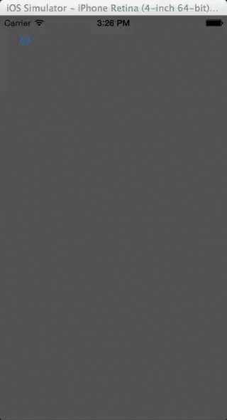

## HMSideDrawerDirectional

This "side drawer" is directional and meant to be used with the storyboard view controllers.
Its a static class so if you need multiple youd have to duplicate it under a different name but most apps use the same side menu so this works great.





### Usage

```objective-c

  // in the main storyboard, add a view controller with a specific ID for example "SideDrawerViewControllerId"

  // the UIViewController linked to by "SideDrawerViewControllerId" should implement the <HMSideDrawerDirectionalDelegate> protocol
  @interface SideDrawerViewController () <HMSideDrawerDirectionalDelegate>

  // application:didFinishLaunchingWithOptions:
  UIStoryboard* storyboard = self.window.rootViewController.storyboard; // ref to main storyboard
    UIViewController* sideDrawerViewController = [storyboard instantiateViewControllerWithIdentifier:@"SideDrawerViewControllerId"]; // id of the side view controller to me used
    [HMSideDrawerDirectional initWithWindow:self.window // window for size
                         withViewController:sideDrawerViewController // which view controller to reveal
                            withShrinkScale:HMSideDrawerDirectional_DEFAULT_SCALE // how much to shrink
                      withShowAnimationTime:HMSideDrawerDirectional_DEFAULT_DURATION_SHOW // seconds to animate to reveal
                      withHideAnimationTime:HMSideDrawerDirectional_DEFAULT_DURATION_HIDE // seconds to animate when hiding
                   withRotationDegreesAngle:HMSideDrawerDirectional_DEFAULT_DEGREE // degrees to rotate the view
                              withDirection:HMSideDrawerDirectional_SIDE_DRAWER_DIRECTION_RIGHT]; // direction of hiding the view to reveal the side menu

  // set the delegate and show
  [HMSideDrawerDirectional delegate:self];
  [HMSideDrawerDirectional toggleMenuFromViewController:self];

  // delegate protocol for receiving notifications when hiding or showing
  <HMSideDrawerDirectionalDelegate>
  #pragma mark : side drawer delegate

  -(void)sideDrawerWillAppearWithAnimationTime:(NSTimeInterval)animationTime
  {
      NSLog(@"will appear %f", animationTime);
  }
  -(void)sideDrawerDidAppear
  {
      NSLog(@"did appear");
  }
  -(void)sideDrawerWillHideWithAnimationTime:(NSTimeInterval)animationTime
  {
      NSLog(@"will hide %f", animationTime);
  }
  -(void)sideDrawerDidHide
  {
      NSLog(@"did hide");
  }

  // hiding the drawer in any class
  [HMSideDrawerDirectional hideSideDrawer];

```
### Contact
http://hellomihai.wordpress.com/

### License

Available under the MIT License. See the LICENSE file for more.